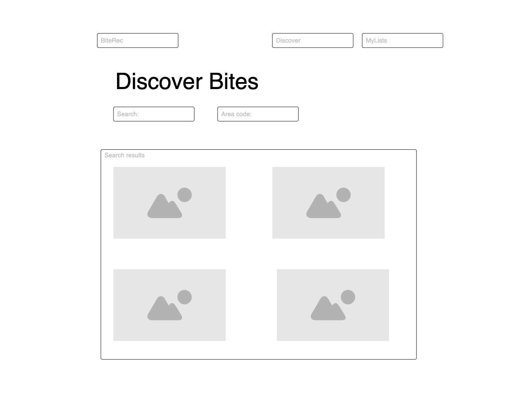
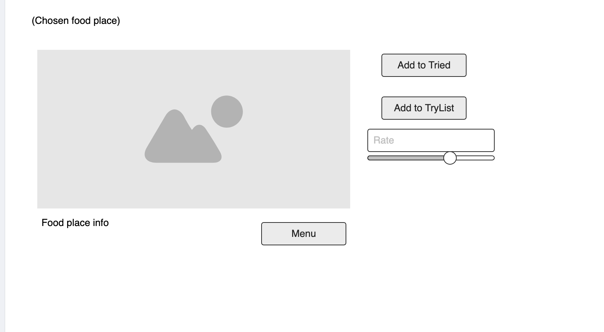
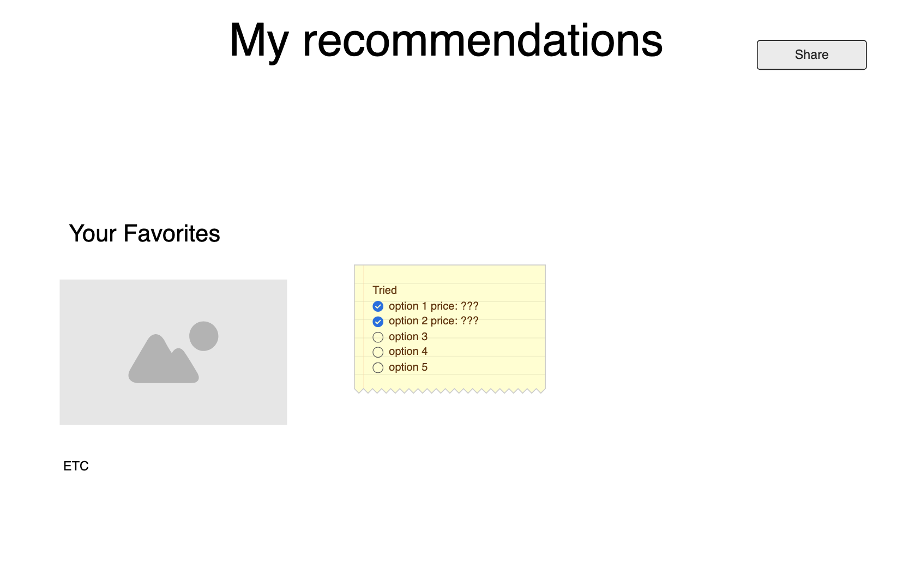
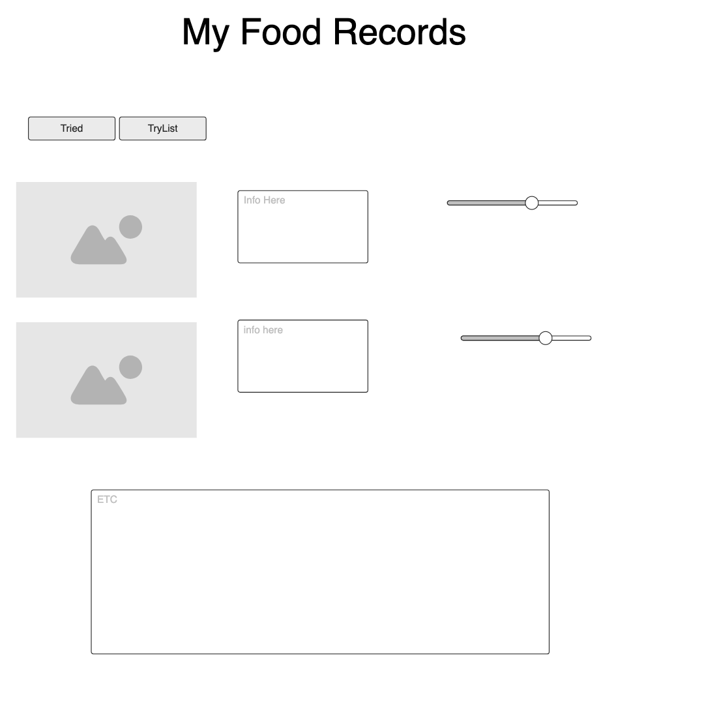

# BiteRec

## Project Spec

I am creating an app inspired by Letterboxd, but for people who want to try and track new food. I will call it BiteRec, and it will let users log restaurants, cafés, and food trucks they have tried or want to visit. Users will be able to rate their experiences, write notes about what they ordered, and even save the location for future reference. The main idea is to make a clean, simple tool that food lovers can use to record what they eat, where they go, and what they want to try next, all in one place.

The app will focus on personal food discovery and memory. Many people enjoy trying new restaurants or local hidden gems, but quickly forget which places they loved or what dish stood out. BiteRec solves that problem by allowing users to create a “to-try” list for new food spots and easily move them to their “tried” list once they’ve visited. Each entry will store details like the restaurant’s name, location, category, rating, and optional notes about the visit. Users can add what meal they ordered, describe what they liked or disliked, and rate the overall experience on a 1–5 scale. For people who want a little more detail, there will be an optional price tracking feature so they can record how much they spent on an item or meal. The price field can be turned on or off in settings, giving users flexibility based on how simple or detailed they want their log to be.

Another major feature will be automatic categorization. When a user enters a new place, the app will detect common keywords in the name or notes to suggest a category. For example, if the restaurant name includes words like “pizza” or “pizzeria,” it will be categorized under Pizza, or if it says “coffee,” it will fall under Café. This automatic classification will make it easier to filter and organize entries, while still allowing users to manually override the category if they prefer. Over time, this feature could become more “smart” by using a growing list of recognized terms or even integrating with location data.

The design will be clean, modern, and innovative. Eventually, I would like to roll over to making this a mobile app. The layout will be organized into a few main pages: a home page that summarizes how many places the user has tried and still wants to visit, an add page for submitting new places, a list page for viewing and filtering entries, and an explore page that helps users discover nearby restaurants. Everything will be easy to navigate with simple buttons and cards that display restaurant names, ratings, and categories at a glance. The overall look will emphasize readability and smooth usability, keeping things minimal while still feeling polished.

In addition to the core features, BiteRec will include thoughtful touches that make it more engaging over time. Users will be able to filter their list by category or rating, search for specific restaurants, and quickly jump between their “To Try” and “Tried” lists. The interface will include icons and color-coded tags to make it easy to tell different types of restaurants apart at a glance, for example, red tags for fast food, green for casual dining, and gold for higher-end places. Future stretch goals include features like an interactive map showing visited and saved spots, the ability to upload photos of meals, or even a recommendation system that suggests similar restaurants based on past entries.

The overall goal of BiteRec is to create a personal, easy-to-use digital food journal that blends memory keeping with exploration. It’s designed for anyone who enjoys eating out, whether it’s someone who wants to remember their favorite burger joint, track new coffee shops, or simply organize where to eat next weekend. The app will make discovering, revisiting, and organizing dining experiences both fun and intuitive, while keeping everything user-friendly and visually appealing.

## Project Wireframe

